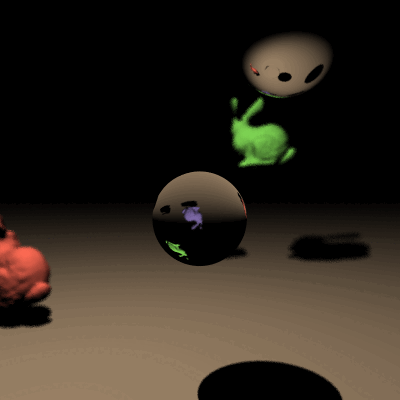

# C# Ray Tracer Program: University Project

## Final scene render



This render took **9** minutes and **28** seconds on my PC.

I used the following command to render the image exactly as shown:

```
dotnet run -- -f tests/final_scene.txt -x 3 --aperture-radius 0.04 --focal-length 3.5 -m 24 -s 24
```

## Implemented Features
- Whitted Illumination Shading Model
- OBJ file loading with BVH data structure optimisation
- Custom camera transforms
- Anti-aliasing
- Adjustable depth-of-field
- Pre-defined simple animation

## Approaches

### Stage 3.1 OBJ Model Optimisation
Without optimisations, the OBJ model would require each of its triangles
to be tested for ray intersections for each pixel during ray tracing.

A simple BVH data structure was implemented to reduce computation time
significantly. Once the OBJ constructor method reads an OBJ file, the triangles
are passed to the `BVHNode` constructor. This class sorts the triangles based on location,
typically this is done using axis-aligned bounding boxes and triangle centroids, but
due to time constraints, triangles are arbitrarily sorted based on their `v0` X-axis location.
Sorting the triangles spacially generally makes bounding boxes smaller and balances the tree.

Bounding boxes are then created for each triangle, which are contained in larger bounding
boxes to have a recursive structure. The BVH structure here is presented as a binary tree,
with bounding boxes containing all child nodes to cut down on ray tracing.

Bounding boxes implement the slab method to test for ray intersections; each axis has a defined
slab and we check if the ray intersects with these slabs.

By introducing the BVH structure, for an OBJ model that takes up very little screen space,
the ray tracer would only need to test for intersection with the parent bounding box for most
pixels, thereby significantly reducing render time. The ray tracer would travel down the children
of the bounding box so long as a ray keeps intersecting with the slabs, until it reaches a triangle.

### Stage 3.2.A.1 Anti-Aliasing Approach
With anti-aliasing multiplier set to an integer 1<, the `Scene.Render `method
takes an alternate path. The anti-aliasing path iterates thorough each pixel
of the image, for example 9 times, subsampling a pixel into 9 square sub-pixels of a grid.

A ray is traced through the centre of each sub-pixel, and the colour contribution for 
each sub-pixel is added to the pixel's total colour. To calculate the average colour,
we divide by the AAMultiplier squared (9 in our example). This ends up blending
nearby pixels, thus smoothing edges.

### Stage 3.2.A.3 Depth of Field Blur Approach
Depth of field is implemented by sampling a point on an imaginary camera sensor disk, and
offsetting the ray origin by this amount. By doing this, each ray is given a randomised direction
that crosses through the focal point. The `Camera` class is given an `ApertureRadius` and `FocalLength` attribute.

Within the anti-aliasing loop, an arbitrary number of DOF samples (2) is used on each AA sub-pixel,
dividing the a whole pixel into `(AAMultiplier x DOF_MaxSamples)^2` sub-pixels.

By randomising the ray direction at the sub-pixel level, objects that are at the focal point are accurately hit,
giving a sharp image, while others outside of the focal length have a blurred effect due to the random direction
having more exaggerated effects on hit accuracy.

### Stage 3.2.C.1 Simple Animation Approach
This currently assumes that simple animations will only be for OBJ models made of triangles.

Within the `Scene.Render` method, the animations of the scene are iterated over and checked
if they are a SimpleAnimation type. If it is, we call the `Update()` method for the SimpleAnimation.

The `SimpleAnimation` class only checks for OBJ model animations so far, and if it detects that it's associated
entity is an `ObjModel` type, it calls the `ApplyTransform()` method of the OBJ model. 

Within this method, a new transform is created that applies the translation of the animation. This ends up
being the pivot point of the rotation of the vertices. The list of triangles of the OBJ model is iterated over
and the transforms are applied to each vertex of each triangle. Translation is applied through simple vector addition,
and the rotation of a vector is applied by rotating around its local coordinates rather than the world coordinates.
It's normal is recalculated based on these transforms.

## References
- https://raytracing.github.io/books/RayTracingTheNextWeek.html#boundingvolumehierarchies
- https://www.scratchapixel.com/lessons/3d-basic-rendering/introduction-to-ray-tracing/implementing-the-raytracing-algorithm.html
- https://www.scratchapixel.com/lessons/3d-basic-rendering/ray-tracing-generating-camera-rays/standard-coordinate-systems.html
- https://www.scratchapixel.com/lessons/3d-basic-rendering/computing-pixel-coordinates-of-3d-point/mathematics-computing-2d-coordinates-of-3d-points.html
- https://box2d.org/files/ErinCatto_DynamicBVH_GDC2019.pdf
